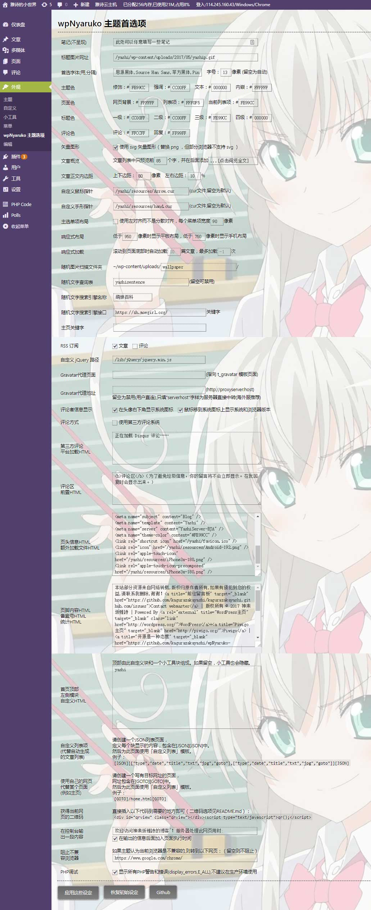

# wpNyaruko-W

- 雅诗的个人网站中使用的 WordPress 主题 wpNyaruko-W 。
- 继承于由 kagurazakayashi(神楽坂雅詩) 和 0wew0 共同开发的「wpNyaruko」主题，「W」版本为雅诗个人维护的分支。
- 该主题为定制向主题，不保证在其他网站上可以正确运行，也不提供支持。
- 这是[雅诗个人网站项目](https://github.com/kagurazakayashi/kagurazakayashi.github.com)的一部分。

## 功能

主题具有 响应式布局，动态加载文章，随机主题元素，特殊页面 等功能。

- 大头图布局。
- 菜单栏和底部版权栏为相对半伸出布局。
- 顶端图片和底端图片分别显示主题图片的上半部分和下半部分。
- 主题图片为随机图片，从文件夹中抽取，每次刷新随机一张。
- 右上角提供随机文字，从数据库中抽取，点击出处名称可前往萌百查词条。
- 多处元素有轻微的鼠标移过效果。
- 响应式布局，菜单和底栏可变为全宽或最小化到右下角可展开菜单。
- 文章列表为固定尺寸块状布局，平铺于屏幕。
- 鼠标移过文章列表时有阴影和图片的动画效果。
- 改变窗口大小时有块重新布局动画。
- 点击前往文章页时有展开平滑过渡网页的动画。
- 动态加载，网页到底部时自动加载更多文章到列表中。
- 可以创建特殊页面，可以实现在页面中写链接自动跳转和写JSON自定列表。
- 自定义的鼠标指针。
- 简洁的搜索框。
- 文章页小工具区域根据响应式布局自动移动。
- 可以小窗显示的隐私策略等通知内容。
- 可以从分类目录、搜索、JSON文章来创建列表。
- 以及很多来自友链页「YashiLink」中的效果。

## 兼容性

- 欢迎使用最新版 Chrome 浏览器，这是该主题的开发环境。
- 支持其他带有最新版 webkit 内核浏览器。
- 可以适配最新版 Firefox 浏览器。
- IE 去死。
- 欢迎使用最新版 iOS 里的 Safari ，这是该主题的开发环境。
- Android 请使用最新版 Chrome 浏览器。
- WP IE 去死。
- 要正常使用，浏览器必须开启 JavaScript 。
- 要保存个性化设置，浏览器需要开启 Cookie 。

## 截图




## 许可协议
MIT License.

```
                   ,;;77;
                 ...     7
            .;;;,       7D
          .7;.          S
         ::           ;3;.,.
       ..        ..;:;T;,;;;;, :.
      :.       ,,,77TJ:,::;:;: .,,.               .
     :        JY.;;Y;;:::;;;.  ..:;.             ..
    :        Jh;.:J;.,7:;;:   ..:,;;            ...
   :.       .3J7,7;.,:;;.:,::;..;;:;:           ::
  .,        cT;;JY;.:;:7,;7:;;;.;;:;;         ..:;...
  :        .C;7vU17.:7;Y:777;:7,:7::;.     ..:..:. ..,.
  .       . YJU77;Y,7c7;Y:..c;Y:;J;.;.    : .:,.:..   7::
            xhTT7C97v7,.TTGZv7v:YJ7;;;       ..;:::. .7; ;
,          .7xuH7 @7.   .7@@c;,;E77777;      .:,,.,;7;v, ,
:            :H1T  .      7: ..;7Tc7777v777Ic,:: 7;, ;7 .:
;             EYh           ,.7vGhh3c7;;;;7;..: ,;.,TT;.,
,            T7:CT.  ;;;   ::I@@R37UC3c77v: .,  ;::7;.:
:           :J .UUT;;  .  uH;@b    .7I1SS. .,. 7T77;.
;          .7  7IY ;@@BH:@B.@R   .:T.  .. ... :CJcJc7;:::.
.     .   .;.  v;.  @@BJYR Y@c .:.Z;  . .... .T7vcITTcc;;;7
          ;        :Z;;T;,:@Bu..;;JY      ...Tv;,  .;YUI7;;c
  IYYcvc;::  .;;. ;H,:TT:.J3@B, :. ;.:7;77YYIvJv7;.   ,.:;;;.
 .b  .,:v;:;::GE7cZuc;bR.7 ;b@U  :. ,YcYJJTJ;cYcJYcv.     77.
 :Y    ;.     ;  777;1@;:Y77u@b  : ;bHG7;;;;  .7TJ77Y;. .  c:
  .   ;c      ;: 37:@@b.ZSx7;@@D.  YY  ,.,,;7;  .777;77;   7;
     .;;       7 ;, ;cx,@YJ ;;CB@H.;Zv7IHUGZ;77    ;7;777  ;;
     ;..;      ,;      ;RT.,c.ZG6B6bB@@@bB@GU777    ;Y;77: ;
     ;: v;.     .:,   :: G1U@@BEb7x@6h0b9GDC, :;7    ;;,cc;
      ;  ..       .:,,;; ;@@bbb@bB1YDDHbRBB6T  ;v;    ; ;;7
      .,             E@.b@B6R9b@Y7;,uRE6bBBb@@@REbh  .. ; 7.
                   :;@@,;@b99Rb@;  .:@60bb;   .  T@3    7 7.
                ... 0;bT Yb696@RU;..ERGubb7c      S7   ;, :
             .,,     7BB;7669b;  ;T;UR3SR@.TTb    ;.   .
            ,.       .;Y@3Bb9DUvhB@CG096@J ;U7   ..
           .        .  7J.@bRbBBbR@@@Rb@ 7:YU@
         .:     ..;;;;;:;vI;@HBBBDb@xR@.:U 6;T
        :;,..:;;;;:::...   .E;u07@S7TC,;B.76
        .;;;;;;.  .        3@    x7 RI YR
           .               G:      :
                                  .;  .
                                  .;...
                                   ;; .
                                   ;:.
                                   ;:.
                                  ::
                                 ;;;
                                ;;;;
                              ,;:7:
                              RS7
```